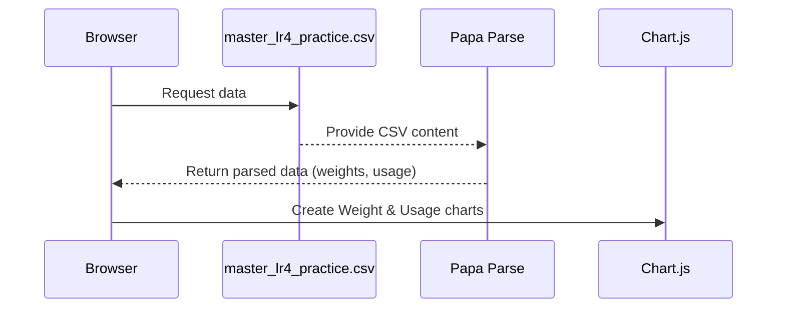

# Chapter 1: Dashboard (index.html)

Welcome to the first chapter of our Litter Robot Home Automation tutorial! In this chapter, we’ll look at the “Dashboard,” which is the main web page (index.html). Think of it like a scoreboard for your cat’s litter box data: it shows your cat’s daily weight trends and how many times the litter box was used each day. This way, you don’t have to wade through lots of raw numbers—you can look at simple charts instead.

---
## Why Have a Dashboard?
Imagine you have to monitor how your cat’s weight changes over time and how often they use their litter box. You could open a CSV or spreadsheet daily, but that can get tedious. Instead, a neat dashboard shows it all at a glance:

• A line chart for average daily weight.  
• Another line chart for daily litter box usage.  

This “control panel” quickly tells you if your cat is stable, gaining or losing weight, and how frequently the litter box is in action.

---
## At a Glance: index.html
Below is a simplified look at the HTML structure. We’ll break it into smaller snippets so it’s easy to follow. (We’re using [Chart.js](https://www.chartjs.org/) to display the charts and [Papa Parse](https://www.papaparse.com/) to read CSV data.)

```html
<!DOCTYPE html>
<html lang="en">
<head>
  <!-- We include Chart.js and Papa Parse here -->
</head>
<body>
  <!-- We place two chart placeholders for Weight and Usage -->
  <canvas id="weightChart"></canvas>
  <canvas id="usageChart"></canvas>

  <script>
    // We'll add our chart-building code in here
  </script>
</body>
</html>
```

### Explanation
1. `<canvas id="weightChart"></canvas>` and `<canvas id="usageChart"></canvas>` are the blank canvases where Chart.js draws our line charts.  
2. Papa Parse and Chart.js are loaded in the `<head>` to handle CSV parsing and chart creation.  

---
## How It Works Under the Hood

When you load the dashboard, here’s the general flow:



1. The browser (your webpage) grabs a CSV file containing past data.  
2. Papa Parse reads and breaks the CSV file into rows of data.  
3. Using JavaScript, we filter that data to grab the weight and usage information and group them by date.  
4. Finally, we feed these processed results to Chart.js, which draws two line charts showing daily average weight and daily usage counts.

---
## Key Concepts in the Code

### 1) Reading CSV Data
```js
Papa.parse('./master_lr4_practice.csv', {
  download: true,
  header: true,
  complete: function(results) {
    // 'results.data' now holds the rows from the CSV
    // We'll build charts using that data!
  }
});
```
• Papa Parse downloads the CSV and converts each row into an object.  
• `header: true` means it treats the first row in your CSV as a header with field names.

### 2) Filtering and Grouping Data
Inside our script, we filter rows that match certain criteria ("Weight Recorded") and group them by date to compute daily averages. For example:

```js
function filterWeight(csvRows) {
  return csvRows.filter(row => row.Activity === 'Weight Recorded');
}

function groupByDate(filteredRows) {
  // We'll put rows with the same date in the same bucket
  // for easy averaging later.
}
```
• We can remove any rows that are not weight measurements or that are out of range.  
• Then for each date, we put all weight values in a list to calculate an average.

### 3) Drawing the Charts
```js
function createChart(chartId, data, labelName) {
  new Chart(document.getElementById(chartId), {
    type: 'line',
    data: {
      labels: data.dates,        // e.g.: ["2024-04-22", "2024-04-23"]
      datasets: [{
        label: labelName,
        data: data.values,       // e.g.: daily averages
        borderColor: 'blue',
        backgroundColor: 'lightblue'
      }]
    }
  });
}
```
• We pass the `canvas` ID (like `"weightChart"`) and data arrays to Chart.js.  
• The chart is rendered automatically in your browser.

---
## A Simple Use Case

Let’s say your cat’s daily weight changes are recorded like this in a CSV:  
- 2024-04-22 → 8.2 lbs  
- 2024-04-23 → 8.1 lbs  
- 2024-04-24 → 8.3 lbs  

Then, when you open the dashboard (index.html), you’ll see a beautiful line chart with points on those dates, making it super easy to see if your cat’s weight is trending up or down over time.

---
## Step-by-Step

1. You open index.html in a browser.  
2. The script fetches and parses the CSV.  
3. It extracts the days you care about (e.g., the last 90 days).  
4. It builds lines on the chart for average weight and usage frequency.  

In coding terms:
- Papa Parse is the “reader.”  
- A small set of JavaScript functions do the calculations.  
- Chart.js draws the final graphs.

---
## Wrapping Up & Next Steps

Congratulations! You now understand how index.html displays your cat’s vital stats at a glance. This is your main “control panel” for daily monitoring. In the next chapter, we’ll look at a different part of this system called [LitterRobotMonitor](02_litterrobotmonitor_.md), which helps feed data into this dashboard for you to see in real time.

See you in the next chapter!

---

Generated by [AI Codebase Knowledge Builder](https://github.com/The-Pocket/Tutorial-Codebase-Knowledge)