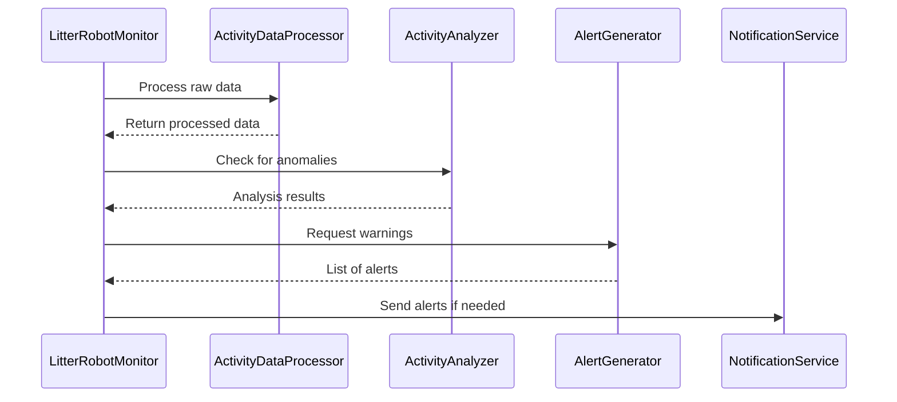

# Chapter 2: LitterRobotMonitor

In [Chapter 1: Dashboard (index.html)](01_dashboard__index_html__.md), we explored how to display your cat’s litter box stats at a glance. Now let’s see where that data comes from. Enter the LitterRobotMonitor: the behind-the-scenes “stage manager” that ensures fresh data is fetched, processed, and delivered to your dashboard.

---

## Why Have a “Grand Organizer”?

Imagine if you had to:
• Fetch new litter box data from the internet daily.  
• Clean (or “process”) the raw data for clarity.  
• Look for odd behavior (like a sudden drop in cat’s weight).  
• Alert yourself if something looks off.  

Doing all this by hand every day would be tedious! The LitterRobotMonitor automatically orchestrates these steps. Think of it as a stage manager in a theater:
• It calls on the [ActivityDataProcessor](03_activitydataprocessor_.md) to interpret the day’s events (like cat visits).  
• Hands results to the [ActivityAnalyzer](04_activityanalyzer_.md) to see if there’s anything suspicious.  
• If something’s wrong, it asks the [AlertGenerator](06_alertgenerator_.md) to produce warnings.  
• Finally, it checks with the [NotificationService](07_notificationservice_.md) to send any needed alerts.  

By controlling the show from start to finish, it ensures all the daily chores get done automatically.

---

## High-Level Flow

Below is a simplified look at how the LitterRobotMonitor ties everything together:



In simple words:
1. LitterRobotMonitor grabs the day’s events from a remote source.  
2. ActivityDataProcessor cleans and reshapes these events into consistent data.  
3. ActivityAnalyzer flags any potential problems.  
4. AlertGenerator drafts the messages you need to know.  
5. NotificationService (email or Slack) sends the alerts to you.

---

## A Real-World Example

Suppose your smart Litter Robot logs these events for a day:
• “Pet Weight Recorded: 8.2 lbs”  
• “Clean Cycles: 1”  
• “Pet Weight Recorded: 8.3 lbs”  

The LitterRobotMonitor will do the following:
1. Pull down these events.  
2. Convert them into a friendly format (e.g., a structured table).  
3. Notice the weight is within normal range (say safe is 8–9 lbs).  
4. Check if the usage count is normal (for example, 4 to 9 times a day).  
5. If everything looks good, no alerts are issued. Otherwise, it triggers warnings.

---

## Using the LitterRobotMonitor in Your Code

Here’s a tiny snippet showing how you might initialize the LitterRobotMonitor and run it. (We’ll skip most real code details for simplicity.)

```python
# File: main.py

from my_project.litterrobotmonitor import LitterRobotMonitor

# Step 1: Create the monitor
monitor = LitterRobotMonitor()

# Step 2: Start the process
monitor.run()  # This fetches data, analyzes it, and sends alerts if needed
```

Explanation:
1. Import the `LitterRobotMonitor`.  
2. Instantiate `monitor`.  
3. Call `monitor.run()`. Under the hood, it orchestrates everything: data fetching, processing, analyzing, alerting, etc.

---

## Inside the LitterRobotMonitor

To give you a peek behind the curtain, here’s a simplified outline of how this “grand organizer” is built:

```python
# Step 1: Initialize supporting services
def __init__(self):
    self.data_processor = ActivityDataProcessor()
    self.alert_generator = AlertGenerator()
    self.notification_service = NotificationService()
    # ... more initialization if needed

# Step 2: Main routine
def run(self):
    events = self.fetch_data_remotely()      # <--- get events
    processed = self.data_processor.run(events)
    warnings = self._analyze_and_alert(processed)
    self._notify_if_needed(warnings)
```

Explanation:  
• `__init__()` sets up the supporting cast.  
• `run()` is your single “go” button. It fetches new data, processes it, and passes the results along to see if you need any alerts.  

---

### Step-by-Step Flow Under the Hood

1. The monitor calls a method like `fetch_data_remotely()` to get raw data from an API or file.  
2. The data is handed to [ActivityDataProcessor](03_activitydataprocessor_.md) for cleaning (e.g., converting “Pet Weight Recorded: 8.3 lbs” to a numeric weight of 8.3).  
3. Once cleaned, the LitterRobotMonitor checks with [ActivityAnalyzer](04_activityanalyzer_.md) to look for unusual patterns (like “usage too high” or “weight too low”).  
4. If anything is out of the ordinary, it tells [AlertGenerator](06_alertgenerator_.md) to create human-readable messages.  
5. Finally, if there are any alerts, the [NotificationService](07_notificationservice_.md) is asked to send them via email or Slack.

---

## Minimal Example: “Hello LitterRobotMonitor”

Below is a very bare-bones sample of how the class could look in pseudo-code. Details are removed to keep it beginner-friendly.

```python
class LitterRobotMonitor:
    def __init__(self):
        self.data_processor = ActivityDataProcessor()
        self.alert_generator = AlertGenerator()
        self.notification_service = NotificationService()

    def run(self):
        raw_data = self.fetch_data_remotely()
        clean_data = self.data_processor.run(raw_data)
        
        # Here you could pass clean_data to an "analyzer"
        # to detect issues (omitted for brevity).
        
        # Suppose we have some alerts:
        alerts = ["Your cat’s weight is below normal!"]
        
        if alerts:
            self.notification_service.send(alerts)
```

Explanation:  
• `data_processor.run(raw_data)` is just a placeholder for the logic that turns messy data into consistent records.  
• `alerts` is a made-up example of a dangerous condition. If there’s danger, `notification_service.send(alerts)` spreads the word.  

---

## Wrapping Up

The LitterRobotMonitor is your system’s coordinator. It ensures data flows smoothly to your [Dashboard (index.html)](01_dashboard__index_html__.md), flags weird patterns, and nudges you if something needs attention. 

In the next chapter, we’ll explore how data gets cleaned and prepared by the [ActivityDataProcessor](03_activitydataprocessor_.md). That will give us a clearer view of how events like “Pet Weight Recorded: 8.2 lbs” turn into tidy numeric data for analysis.

See you there!

---

Generated by [AI Codebase Knowledge Builder](https://github.com/The-Pocket/Tutorial-Codebase-Knowledge)