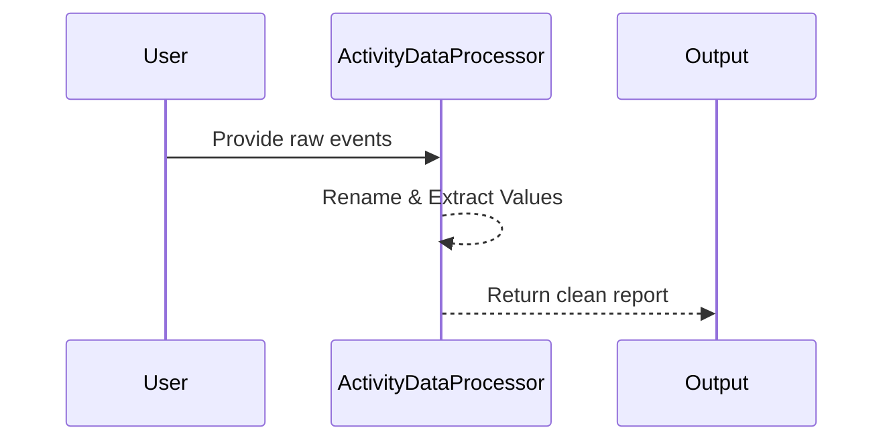

# Chapter 3: ActivityDataProcessor

In [Chapter 2: LitterRobotMonitor](02_litterrobotmonitor_.md), we saw how the “grand organizer” collects raw events from the Litter-Robot. But these events aren’t always friendly for humans to read—a cat visit could be log-labeled as `"LitterBoxStatus.CAT_DETECTED"` or `"LitterBoxStatus.CLEAN_CYCLE_COMPLETE"`. Enter the ActivityDataProcessor, which acts like a helpful translator: it takes those raw, cryptic events and transforms them into a simpler, consistent record that can be easily understood and analyzed.

---

## Why Do We Need It?

Imagine you have a list of logs like this:
• "LitterBoxStatus.CAT_SENSOR_INTERRUPTED"  
• "Pet Weight Recorded: 8.2 lbs"  
• "LitterBoxStatus.CLEAN_CYCLE_COMPLETE"  

Groovy for a machine, but not very friendly for you. The ActivityDataProcessor steps in, identifies the real meaning behind each event, and normalizes it. It might rename `"LitterBoxStatus.CAT_SENSOR_INTERRUPTED"` to `"Cycle Interrupted"`, and for `"Pet Weight Recorded: 8.2 lbs"`, it extracts the number `8.2` to keep it in a dedicated “Value” field, so you can see it in your dashboard easily.

---

## A Central Use Case

Let’s say you want to generate a daily summary of:
1. How many times your cat weighed in.  
2. How many cleaning cycles went on.  
3. Any special events like “Cycle Interrupted.”  

Instead of manually reading logs like “LitterBoxStatus.CLEAN_CYCLE_IN_PROGRESS,” the ActivityDataProcessor will give you a simplified table saying “Clean Cycle In Progress” at the correct times, plus an extracted numeric weight whenever it sees messages like “Pet Weight Recorded: 8.2 lbs.”

---

## Key Concepts

1. Event Renaming:  
   • Technical codes like “LitterBoxStatus.CAT_DETECTED” get changed to simpler labels like “Cat Detected.”

2. Value Extraction:  
   • Whenever an event includes a numeric value (e.g., “Weight Recorded: 8.2 lbs”), the processor pulls out the `8.2` and stores it separately.

3. Clean and Sorted Output:  
   • The final data is tidied, sorted, and ready—no more wading through raw strings manually.

---

## How It Works (Step by Step)

Here’s a quick look at how the ActivityDataProcessor converts raw logs into a neat record:



1. You pass a list of raw event strings into the processor.  
2. The processor checks for known patterns and applies simpler labels.  
3. If there’s a number (like 8.2 lbs), it pulls it out into a separate “Value” field.  
4. Finally, it returns a polished list or table for easy reading.

---

## Usage Example

Below is a tiny snippet showing how you might use this processor in Python.  

```python
# File: example_processor_usage.py
# (Imagine we have an ActivityDataProcessor imported from somewhere.)

events = [
  "LitterBoxStatus.CAT_DETECTED",
  "Pet Weight Recorded: 8.2 lbs",
  "LitterBoxStatus.CLEAN_CYCLE_COMPLETE"
]

processor = ActivityDataProcessor()
clean_data = processor.process_activities(events)

print(clean_data)
# Expected output might look like:
# [
#   { "Activity": "Cat Detected", "Value": None },
#   { "Activity": "Weight Recorded", "Value": 8.2 },
#   { "Activity": "Clean Cycle Complete", "Value": None }
# ]
```
Explanation:  
• We create a simple list of raw event strings.  
• `processor.process_activities(events)` applies the translation and value extraction.  
• We then get a friendlier list (or DataFrame) that standardizes each event with an “Activity” label and a numeric “Value” (if available).

---

## Under the Hood

Below is a minimal look at the logic inside the ActivityDataProcessor. We’ll remove most details to keep it extra friendly:

```python
class ActivityDataProcessor:
    def process_activities(self, raw_events):
        # 1. Create a structure to hold clean records
        clean_records = []

        # 2. Loop over events to rename and extract info
        for event in raw_events:
            record = self._parse_event(event)
            clean_records.append(record)

        return clean_records

    def _parse_event(self, event):
        # (Imaginary code that checks event string patterns)
        # Return a dictionary like: { "Activity": "Cat Detected", "Value": None }
        return {}
```

Explanation:  
• We keep a list named `clean_records` to gather the processed info.  
• For each `event`, `_parse_event` checks if it’s “Pet Weight Recorded” or “Clean Cycle Complete” (etc.).  
• It returns a new dictionary with simpler labels, plus a numeric `Value` if relevant.

---

## Putting It All Together

Once the ActivityDataProcessor finishes, you’ll have a clean “logbook” of cat visits and device events. That makes life easier in:  
• [Chapter 4: ActivityAnalyzer](04_activityanalyzer_.md): to detect patterns like “weight too low” or “too many cycles.”  
• Your [Dashboard (index.html)](01_dashboard__index_html__.md): to show neat charts of your cat’s weight over time, rather than raw text logs.  

---

## Conclusion & Next Steps

Congrats! You now see how ActivityDataProcessor turns messy logs from “LitterBoxStatus.CAT_DETECTED” or “Pet Weight Recorded: 8.2 lbs” into tidy data, ready for analysis or display. Next, in [ActivityAnalyzer](04_activityanalyzer_.md), we’ll explore how to examine these cleaned events for signs of unusual behavior (like suspiciously low weight or abnormally frequent usage). See you there!

---

Generated by [AI Codebase Knowledge Builder](https://github.com/The-Pocket/Tutorial-Codebase-Knowledge)