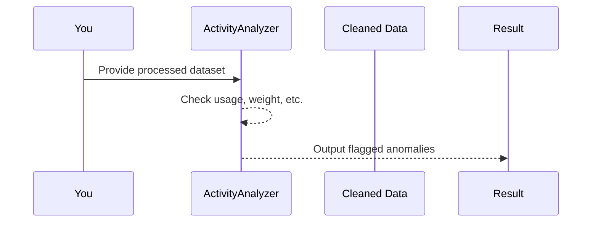

# Chapter 4: ActivityAnalyzer

In [Chapter 3: ActivityDataProcessor](03_activitydataprocessor_.md), we saw how raw Litter-Robot activity logs get cleaned and turned into a simpler dataset. Welcome to the “ActivityAnalyzer,” which is like a detective examining your cat’s day-to-day litter box usage to spot anything unusual—both for your cat’s health and your machine’s performance.

---

## Why We Need an ActivityAnalyzer

Imagine having a day’s worth of tidy data that tells you:
• How often the litter box was used  
• The cat’s weight measurements during each visit  
• The intervals between clean cycles  

But how do we know if any of these numbers are “out of the ordinary”? The ActivityAnalyzer comes to the rescue. Think of it as the brain that flags red alerts, like:

• Usage spikes (too many visits in too short a time)  
• Suspiciously low weight averages (maybe the cat is losing weight)  
• Long delays before the box initiates cleaning  

By automatically deciding what’s normal and what’s not, you get a quick heads-up if your cat needs a vet check, or if the litter box is malfunctioning.

---

## A Concrete Example

Suppose your cleaned data for one day shows:  
• 8 weigh-in records (cat visits)  
• An average weight of 8.2 lbs  
• Three back-to-back weigh-ins with no cleaning cycle in between  

The ActivityAnalyzer can say:  
1. “You had 8 visits—this is within your normal range.”  
2. “Average weight is 8.2 lbs and still healthy.”  
3. “There were several consecutive weigh-ins before a cycle—this might be unusual.”  

It works behind the scenes: you don’t have to dissect the data yourself.

---

## At a Glance: Flow Diagram

Below is a minimal illustration of how the ActivityAnalyzer processes the cleaned activity data:



1. You give the ActivityAnalyzer a ready-to-use dataset (from [ActivityDataProcessor](03_activitydataprocessor_.md)).  
2. It checks usage counts, average weight, and other factors.  
3. It returns a list of anomalies or none if everything is normal.

---

## How to Use ActivityAnalyzer

Below is a super simple example in Python-like pseudocode:

```python
analyzer = ActivityAnalyzer(processed_data)           # processed_data is from ActivityDataProcessor
usage_count = analyzer.get_usage_count()              # e.g., 7 times used
average_weight = analyzer.get_average_weight()        # e.g., 8.2 lbs
has_suspicious_patterns = analyzer.has_consecutive_weights()

print(usage_count, average_weight, has_suspicious_patterns)
```

Explanation:  
• Create an `ActivityAnalyzer` with your “cleaned data.”  
• You can then ask for important stats like usage count or average weight.  
• You can also check for unusual behaviors (like too many consecutive visits).

---

## Key Concepts

1. Counting Usage  
   The analyzer sums the number of scoops/clean cycles to see if your cat is within a healthy daily range.

2. Average Weight Checks  
   It calculates the mean weight from visits labeled “Weight Recorded,” then compares it to usual healthy ranges.

3. Unusual Pattern Detection  
   It looks for patterns like consecutive weigh-ins (cat keeps re-entering without a clean cycle) or abnormally long gaps before cleaning. These can signal health issues or machine malfunctions.

---

## Under the Hood (Simplified)

Here’s a short peek at what the ActivityAnalyzer might do inside:

```python
class ActivityAnalyzer:
    def __init__(self, df):
        self.df = df  # The cleaned DataFrame
    
    def get_usage_count(self):
        # Count how many 'Clean Cycle In Progress' events
        return (self.df["Activity"] == "Clean Cycle In Progress").sum()
    
    def get_average_weight(self):
        # Filter rows where Activity == 'Weight Recorded' and compute average
        weights = self.df[self.df["Activity"] == "Weight Recorded"]["Value"]
        return weights.mean() if len(weights) > 0 else None
```

Explanation:  
• The analyzer keeps a reference to the cleaned dataset (`df`).  
• `get_usage_count()` simply returns how many times the cat used the box.  
• `get_average_weight()` computes the mean weight from valid entries.

---

## Putting It All Together

1. You gather and clean raw logs with [ActivityDataProcessor](03_activitydataprocessor_.md).  
2. You hand that cleaned dataset to the ActivityAnalyzer.  
3. The analyzer checks counts, averages, and patterns.  
4. If something looks off, it signals alarms so you can investigate.

---

## Conclusion & Next Steps

Congratulations! You now know how the ActivityAnalyzer picks out worrying patterns from your cat’s litter box activities. It’s your go-to detective for day-to-day events.

In the next chapter, we’ll see how [Config](05_config_.md) helps us set thresholds (e.g., healthy weight ranges) that the ActivityAnalyzer relies on to raise red flags. See you there!

---

Generated by [AI Codebase Knowledge Builder](https://github.com/The-Pocket/Tutorial-Codebase-Knowledge)