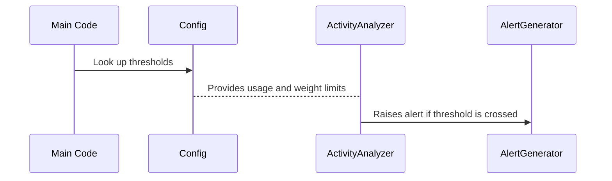

# Chapter 5: Config

In [Chapter 4: ActivityAnalyzer](04_activityanalyzer_.md), we discovered how to detect unusual patterns (like too many visits or weight changes) in cleaned litter box data. But how does the analyzer decide what’s “too many” or “too long”? That’s where Config comes in. Think of Config as a master recipe book: it holds all the rules and numbers (thresholds) that your system checks against to see if something needs attention.

---

## Why We Need a “Recipe Book”

Imagine you want your program to warn you if:  
• Your cat goes to the litter box more than 9 times a day.  
• Your cat’s weight is below 8.5 lbs or above 9.1 lbs.  
• The litter drawer is over 75% full.  

With Config, you keep all these thresholds in one place, so you (and all other classes) can easily look up the exact values. It’s much simpler than scattering them all over your code, because when you need to tweak a threshold (like if your vet says your cat should stay between 8.0 and 9.0 lbs), you just update the recipe in Config.

---

## A Central Example

Let’s say your cat visits the litter box 12 times in a day. Usually, 9 times is your “That’s a lot!” threshold. Config has a variable called HIGH_USAGE_THRESHOLD = 9. When the [ActivityAnalyzer](04_activityanalyzer_.md) counts 12 visits, it checks Config’s limit (9), sees that 12 > 9, and declares that usage is too high.

---

## Key Concepts

• “Thresholds” are numeric limits (like how many visits per day is too many).  
• “Ranges” define healthy or valid intervals (e.g., a minimum healthy weight).  
• “Constants” are any fixed settings you don’t expect to change often (like an email server name or log history limits).

---

## How to Use It

Whenever another part of the system needs a rule—like a weight boundary—it just reads from Config:

```python
# Suppose you want to check if weight is healthy
if cat_weight < Config.MIN_HEALTHY_WEIGHT:
    print("Warning: Cat is underweight!")
```

Explanation:
1. We call the Config class directly (e.g., Config.MIN_HEALTHY_WEIGHT).
2. If the cat weighs less than that threshold, we handle it (maybe send an alert).

---

### Another Code Example

If your litter drawer is 80% full, you might do:

```python
drawer_fullness = 80  # Example
if drawer_fullness >= Config.WASTE_ALERT_THRESHOLD:
    print("Litter drawer is over 75% full!")
```

Explanation:
• We compare 80 against WASTE_ALERT_THRESHOLD (75 in Config).  
• It exceeds that number, so you see an alert prompt.

---

## Under the Hood (Step by Step)

Here’s a simple look at how other classes interact with Config:



1. Code (like the ActivityAnalyzer) asks Config: “What’s too many visits per day?”  
2. Config supplies the usage threshold.  
3. The Analyzer compares actual visits to that threshold. If it’s too high, the [AlertGenerator](06_alertgenerator_.md) is told to warn you.

---

## A Peek into the Config Class

Below is a stripped-down version of how Config might look in Python. (We’re commenting out some lines to keep it short.)

```python
class Config:
    LOW_USAGE_THRESHOLD = 4
    HIGH_USAGE_THRESHOLD = 9

    MIN_HEALTHY_WEIGHT = 8.5
    MAX_HEALTHY_WEIGHT = 9.1

    WASTE_ALERT_THRESHOLD = 75
    # ... Additional constants for timeouts, file paths, etc.
```

Explanation:  
• LOW_USAGE_THRESHOLD = 4 → 4 visits or fewer might be too few.  
• HIGH_USAGE_THRESHOLD = 9 → More than 9 visits might be too many.  
• MIN_HEALTHY_WEIGHT = 8.5 → If cat’s average weight goes below 8.5 lbs, send a warning.  
• WASTE_ALERT_THRESHOLD = 75 → 75% full is the “drawer is nearly full” line.

---

## Putting It All Together

• Without Config, every class would guess or store its own limits (and might not agree).  
• With Config as a single source of truth, changing a limit is easy.  
• The rest of your code (like [ActivityAnalyzer](04_activityanalyzer_.md) or [AlertGenerator](06_alertgenerator_.md)) simply checks Config’s numbers.

---

## Conclusion & Next Steps

Hooray! You now know how Config keeps all the important numbers in one central “recipe book,” ensuring everything else in the system stays consistent. This design makes your code simpler to manage whenever you need to adjust thresholds.

Up next, we’ll examine [AlertGenerator](06_alertgenerator_.md) to see how these thresholds turn into warning messages or notifications. See you in the next chapter!

---

Generated by [AI Codebase Knowledge Builder](https://github.com/The-Pocket/Tutorial-Codebase-Knowledge)