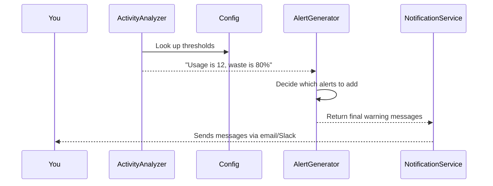

# Chapter 6: AlertGenerator

In the [previous chapter on Config](05_config_.md), we learned where our system’s important numbers (like weight limits or usage thresholds) are stored. Now let’s meet the “AlertGenerator.” Think of it as a friendly neighbor who knocks on your door whenever something seems off. Whenever the [ActivityAnalyzer](04_activityanalyzer_.md) spots unusual patterns—like an overfilled waste drawer or a sudden drop in your cat’s weight—this component decides which specific warnings to send.

---

## Why Do We Need an AlertGenerator?

Sometimes, your cat’s usage might be “just a bit high,” but other times, it could be “urgent—check now!” The AlertGenerator takes the findings (e.g., “weight is below 8.5 lbs, usage is 12 times”) and picks the right phrases to catch your attention. It translates the analysis data into short messages like:

• “Waste basket is 80% full. Please change ASAP.”  
• “Cats used the litter box only 3 times. Investigate!”  

Thanks to AlertGenerator, you don’t have to interpret raw numbers yourself—you get ready-made, readable alerts anytime the system detects a problem.

---

## Central Use Case:
Suppose your cat visited the litter box 12 times yesterday, and your [Config](05_config_.md) says 9 is already “high.” When [ActivityAnalyzer](04_activityanalyzer_.md) flags that usage is above 9, it calls AlertGenerator to produce a friendly message like:

> “:poop: Cats used bathroom 12 times yesterday. Please investigate.”

If also your waste drawer reaches 80% full (above the 75% threshold in Config), AlertGenerator adds another warning. This way, you get a clear list of everything that needs attention in one go.

---

## Diagram: How Alerts Come to Life

Imagine it step-by-step:



1. The [ActivityAnalyzer](04_activityanalyzer_.md) checks your cat’s data against thresholds stored in [Config](05_config_.md).  
2. Once it notices something unusual, it calls AlertGenerator with details: “usage_count=12,” “waste_percent=80,” etc.  
3. AlertGenerator picks the right words based on those numbers.  
4. The [NotificationService](07_notificationservice_.md) finally sends these alerts to you.

---

## Key Concepts

1. Threshold-based Warnings  
   • If usage goes above Config.HIGH_USAGE_THRESHOLD or below Config.LOW_USAGE_THRESHOLD, build usage alerts.  
   • If the waste drawer is beyond WASTE_ALERT_THRESHOLD, create a “full drawer” alert.

2. Health Flags  
   • If average weight is out of the normal range (e.g., < 8.5 lbs), warn the owner to check a vet.

3. Multiple Alerts in One Go  
   • AlertGenerator collects all the relevant warnings for the day (usage, weight, waste level) and returns them in a neat list.

---

## Using AlertGenerator

Below is a small code snippet showing how you might use it:

```python
# Suppose we already have analysis results:
waste_percent = 80
usage_count = 12
avg_weight = 8.4
has_delays = False
has_consecutive = False

generator = AlertGenerator()
alerts = generator.generate_alerts(
    waste_percent,
    usage_count,
    avg_weight,
    has_delays,
    has_consecutive
)

print(alerts)
# ["Waste basket is 80% full. Please change ASAP.",
#  ":poop: Cats used bathroom 12 times yesterday. Please investigate.",
#  "Avg Weight yesterday = 8.4 lbs. Please investigate."]
```

Explanation:
• We pretend the [ActivityAnalyzer](04_activityanalyzer_.md) gave us the 5 inputs (waste usage, cat visits, etc.).  
• “generate_alerts” returns a list of strings, each describing a problem.  
• If no issues, the alerts list might be empty.

---

## A Peek Inside AlertGenerator

Below is a simplified look at its internals. Notice how it can quickly get the right messages based on these values:

```python
class AlertGenerator:
    def generate_alerts(
      self,
      waste_percent,
      usage_count,
      avg_weight,
      has_delays,
      has_consecutive
    ):
        alerts = []

        # If the waste percent is high
        if waste_percent >= Config.WASTE_ALERT_THRESHOLD:
            alerts.append(f"Waste basket is {waste_percent}% full. Please change ASAP.")

        # If usage is too high or too low
        if usage_count > Config.HIGH_USAGE_THRESHOLD:
            alerts.append(f":poop: Used {usage_count} times. Investigate!")
        
        # (Additional checks for weight, delays, consecutive visits...)
        # ...

        return alerts
```

Explanation:
1. AlertGenerator looks for specific conditions, comparing the numbers to [Config](05_config_.md).  
2. Every time a condition is met (like “waste_percent >= 75”), it adds a user-friendly string to a list called “alerts.”  
3. It returns that list to be sent by email or Slack.

---

## Summary & Next Steps

AlertGenerator is your specialized “message crafter,” turning raw analysis into actionable warnings. Whenever your cat’s litter box usage crosses a set threshold, it ensures you hear about it in clear, concise language.

In the next chapter, we’ll discover how those messages are actually delivered to you through [NotificationService](07_notificationservice_.md). See you there!

---

Generated by [AI Codebase Knowledge Builder](https://github.com/The-Pocket/Tutorial-Codebase-Knowledge)