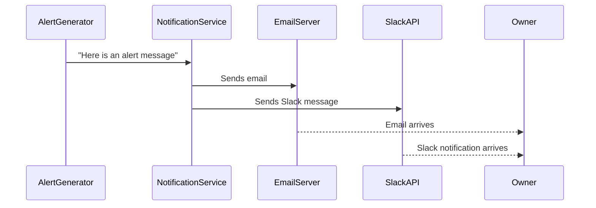

# Chapter 7: NotificationService

In [Chapter 6: AlertGenerator](06_alertgenerator_.md), we learned how our system decides when an alert is necessary (for example, if the cat’s litter box usage is too high or if the cat’s weight is too low). Now, meet the NotificationService—your personal assistant that actually delivers those alerts to you, whether by email or Slack. Instead of individual parts of the system each figuring out how to send messages, every part just says “Hey, NotificationService! Please alert the user!” and the NotificationService handles the rest.

---

## Why a Single “NotificationService”?

Imagine a scenario:  
• You detect that the waste drawer is 80% full.  
• You want both an email alert and a quick Slack message.  
• Tomorrow, you might also want SMS alerts.  

If every component handled its own alerts, you’d have to update each one whenever you add or change a way to notify yourself. With the NotificationService (acting as a personal assistant), any new alert channel (like SMS) can be added in one place. Everyone else just keeps calling the same “assistant.”

---

## A Day-to-Day Example

1. [AlertGenerator](06_alertgenerator_.md) decides that your cat went past the daily usage threshold.  
2. It hands a short message to the NotificationService:  
   “:poop: Cats used bathroom 12 times yesterday. Please investigate.”  
3. The NotificationService logs in to your email account and Slack, then sends that message through both channels.  
4. You get a quick Slack ping on your phone and an email in your inbox.  

All you did was ask AlertGenerator to produce an alert. No fussing with email or Slack details.

---

## Key Concepts

1. Email Notifications  
   • Uses SMTP (Simple Mail Transfer Protocol) to log into your email service.  
   • Sends short messages, warnings, or daily summaries.

2. Slack Notifications  
   • Uses the Slack API to find your user ID.  
   • Opens a direct channel or conversation.  
   • Posts any important alerts (“Drawer is 80% full!”) as a Slack message.

3. Centralized Approach  
   • The rest of the system never touches email or Slack settings directly.  
   • Any changes to credentials or the server environment happen in one place.

---

## How to Use NotificationService

Below is a minimal snippet showing how you might create a NotificationService and send alerts. Notice it’s very short and sweet:

```python
# Create the notification helper
service = NotificationService(
    sender_email="myemail@example.com",
    sender_password="mypassword",
    slack_token="xoxb-123456",
    slack_email="myemail@example.com"
)

# Send an email!
service.send_email(
    subject="Test Email",
    message="Hello! This is a test."
)

# Send a Slack message!
service.send_slack_message(
    "Hello from the Litter Robot system!"
)
```

Explanation:  
• We instantiate `NotificationService` with the credentials needed for email and Slack.  
• Calling `send_email(…)` triggers an email.  
• Calling `send_slack_message(…)` posts to Slack.  
• The rest of your code just says “send these messages,” and the NotificationService does the magic.

---

## Under the Hood: Sequence of Events

Here’s a super simple look at what happens when something wants to send an alert message:



1. [AlertGenerator](06_alertgenerator_.md) or any other component gives the NotificationService one or more messages.  
2. The NotificationService connects to your email service (e.g., Gmail) and Slack’s API.  
3. Both messages arrive in your inbox/Slack channel.  

---

## Under the Hood: In the Code

Below are simplified code snippets to illustrate how NotificationService might look internally (broken into tiny functions). Each code block stays under 10 lines.

### 1) Class Outline

```python
class NotificationService:
    def __init__(self, sender_email, sender_password, slack_token, slack_email):
        self.sender_email = sender_email
        self.sender_password = sender_password
        self.slack_token = slack_token
        self.slack_email = slack_email

    def send_email(self, subject, message):
        # We'll see how this works next...
        pass

    def send_slack_message(self, message):
        # We'll see how this works next...
        pass
```

Explanation:  
• The constructor stores your email info (username/password) and Slack credentials.  
• `send_email(...)` and `send_slack_message(...)` will handle each channel.

---

### 2) Sending Email

```python
def send_email(self, subject, message):
    msg = MIMEText(message)
    msg["Subject"] = subject
    msg["From"] = self.sender_email
    msg["To"] = self.sender_email
    # Connect to SMTP and send
    # ... (omitted details)
```

Explanation:  
• We build a MIME email using the message text.  
• “To” is your own email address (or it could be someone else’s).  
• We then connect to Gmail or another service to actually send it.

---

### 3) Sending Slack Messages

```python
def send_slack_message(self, message):
    user_id = self._get_slack_user_id()
    channel_id = self._open_slack_conversation(user_id)
    self._post_slack_message(channel_id, message)
```

Explanation:  
• First, we fetch your Slack user ID using your email.  
• Next, we open a direct chat channel with that user.  
• Finally, we send the message to that channel.

---

## Bringing It All Together

Thanks to the NotificationService:  
• The entire system has one simple way to deliver updates.  
• Whether it’s an email or Slack message, everything the system wants to tell you goes through this “assistant.”  
• No need for separate code scattered all around your project to handle each new notification style.

---

## Conclusion

The NotificationService is the final piece of our puzzle. It’s your system’s loudspeaker—spreading any important alerts to you quickly and reliably. This centralized approach means you can easily expand or customize how you get notified without rewriting your entire codebase. 

And with that, we’ve reached the end of our Litter Robot Home Automation tutorial! You’ve learned how to build a dashboard, orchestrate data collection, analyze cat usage patterns, generate alerts, and finally broadcast those alerts to your inbox or Slack. May your litter box remain squeaky clean and your cat’s health well monitored! Have fun automating!

---

Generated by [AI Codebase Knowledge Builder](https://github.com/The-Pocket/Tutorial-Codebase-Knowledge)