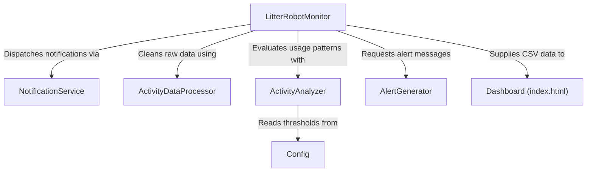

# Tutorial: litter-robot-home-automation

This **Litter Robot Home Automation** project helps cat owners track and analyze
their pets' litter box usage. It automatically *collects* data from the Litter Robot,
*processes* it for clarity, and **alerts** owners of any unusual patterns or fill levels.
There's also a dashboard that provides easy-to-read charts of daily usage and average weight.

**Source Repository:** [https://github.com/jiax264/litter-robot-home-automation](https://github.com/jiax264/litter-robot-home-automation)

## Chapters

1. [Dashboard (index.html)
](01_dashboard__index_html__.md)
2. [LitterRobotMonitor
](02_litterrobotmonitor_.md)
3. [ActivityDataProcessor
](03_activitydataprocessor_.md)
4. [ActivityAnalyzer
](04_activityanalyzer_.md)
5. [Config
](05_config_.md)
6. [AlertGenerator
](06_alertgenerator_.md)
7. [NotificationService
](07_notificationservice_.md)

---

Generated by [AI Codebase Knowledge Builder](https://github.com/The-Pocket/Tutorial-Codebase-Knowledge)